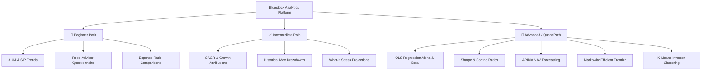

# 🏦 Bluestock Mutual Fund Intelligence Platform

Welcome to the **Bluestock Mutual Fund Intelligence Platform**—a production-grade quantitative analytics and decision-support system designed for investors, traders, and quant analysts.

This platform bridges the gap between **academic financial theory (quant models)** and **practical asset allocation (retail investing)**. Whether you are a beginner looking to set up your first SIP or an advanced quantitative trader designing an optimized multi-asset portfolio, this guide and codebase are organized to serve you.

---

## 🎯 Choose Your Learning & Investment Path

To make this project easy to navigate, we have categorized the systems and files based on your financial expertise:



### 🔰 1. The Beginner Investor Path
If you are new to mutual funds, focus on these dashboard components and metrics:
* **Assets Under Management (AUM)**: Think of this as the total size of the fund. Larger AUM usually indicates trust and stability.
* **Monthly SIP Inflow**: Shows how much money is regularly flowing into the platform. Steady growth means positive sentiment.
* **Robo-Advisor & Personal Asset Allocator (Tab 6)**: Simply enter your risk preferences and investment goals, and the platform recommends an equity/debt split along with the highest-scoring funds.
* **Relevant Files**:
  * [app.py](file:///D:/New%20folder/bluestock_mf_capstone/dashboard/app.py) (Tab 1: Platform Overview & Tab 6: Robo-Advisor).

### 📈 2. The Intermediate Trader/Investor Path
If you understand returns and basic portfolio volatility:
* **CAGR (Compound Annual Growth Rate)**: The average annual growth rate of your investment over time, smoothing out short-term fluctuations.
* **Max Drawdown**: Measures capital protection. It answers: *"If I bought at the absolute peak, what is the worst historical drop I would have suffered?"* (Lower is better).
* **What-If Scenario & Compound Interest Simulator (Tab 6)**: Simulate how your capital compounds, how a 20% market correction impacts your wealth, and how a "buy-the-dip" top-up strategy supercharges recovery.
* **Relevant Files**:
  * [recommender.py](file:///D:/New%20folder/bluestock_mf_capstone/scripts/recommender.py) (Weighted scorecard logic).
  * [app.py](file:///D:/New%20folder/bluestock_mf_capstone/dashboard/app.py) (Tab 2: Fund Performance & Tab 6: What-If Simulator).

### 🔬 3. The Advanced Quant & ML Engineer Path
If you have a background in mathematics, quantitative finance, or machine learning:
* **Sharpe & Sortino Ratios**: Risk-adjusted return metrics. Sharpe penalizes all volatility, while Sortino only penalizes downward (negative) volatility.
* **OLS Beta & Alpha vs Nifty 100**: Daily return regressions. Beta measures sensitivity (slope); Alpha measures outperformance (intercept × 252 annualized).
* **ARIMA Statistical NAV Forecast (Tab 4)**: A statistical model (`ARIMA(1,1,0)`) that projects NAV pathways 180 business days out with a 95% confidence interval band.
* **Markowitz Efficient Frontier (Tab 4)**: Executes quadratic optimization to solve for the portfolio weights of 5 chosen funds that maximize the Sharpe ratio.
* **K-Means Clustering (Tab 5)**: Machine learning segmentation that groups investors into personas based on their incomes, transaction frequencies, and SIP behaviors.
* **Relevant Files**:
  * [compute_metrics.py](file:///D:/New%20folder/bluestock_mf_capstone/scripts/compute_metrics.py) (Risk formulas, rolling volatility).
  * [train_clustering.py](file:///D:/New%20folder/bluestock_mf_capstone/scripts/train_clustering.py) (Scikit-Learn K-Means model).

---

## 📁 Project Architecture & Directories

```
bluestock_mf_capstone/
├── config.yaml               # Settings config (Rf = 6.5%, scorecard weights)
├── run_pipeline.py           # Unified master pipeline orchestrator runner
├── requirements.txt          # Python dependencies list for cloud deployment
├── dashboard.html            # Standalone offline interactive HTML/JS dashboard
├── bluestock_mf_dashboard.pbix # Power BI report template placeholder
│
├── data/
│   ├── raw/                  # 10 CSVs containing raw synthesized transaction & NAV tables
│   ├── processed/            # Intermediary clean, reindexed and forward-filled CSV files
│   └── db/
│       └── bluestock_mf.db   # SQLite Star Schema database (SQL engine)
│
├── notebooks/
│   ├── 01_data_ingestion.ipynb    # API Ingestion tests
│   ├── 02_data_cleaning.ipynb     # Reindexing & forward fill
│   ├── 03_eda_analysis.ipynb      # Initial EDA & Plotly/Seaborn visualization
│   ├── 04_performance_analytics.ipynb # CAGR, Sharpe/Sortino ratios, and OLS regressions
│   └── 05_advanced_analytics.ipynb    # Historical VaR/CVaR, cohorts, and HHI concentrations
│
├── sql/
│   ├── schema.sql            # Star Schema table definitions (dimensions & facts)
│   └── queries.sql           # Core analytical and windowing queries
│
├── scripts/
│   ├── etl_pipeline.py       # Decoupled ETL module converting CSVs to SQLite
│   ├── compute_metrics.py    # Quant calculation engine (returns metrics to database)
│   ├── recommender.py        # Sharpe-based fund recommendation query CLI
│   ├── scheduler.py          # Daily automation scheduler (updates at 8 PM)
│   ├── train_clustering.py   # K-Means segmentation model training
│   ├── run_day6_tasks.py     # Batch runner for advanced risk and cohort reports
│   └── convert_html_charts_to_png.py # Utility to convert dynamic charts to PNG formats
│
├── dashboard/
│   └── app.py                # Premium dark-mode Streamlit dashboard (Zero-overlap UI)
│
└── reports/                  # Generated analytical deliverables & static PNG charts
    ├── fund_scorecard.csv         # Scorecard ranks and composite scores for all 40 funds
    ├── alpha_beta.csv             # OLS regressed Alpha and Beta values vs Nifty 100
    ├── var_cvar_report.csv        # Historical 95% Value at Risk & CVaR report
    ├── cohort_analysis.csv        # Investor cohort (2024 vs 2025) characteristics
    ├── sip_continuity.csv         # MoM transaction gap and churn alert matrix
    ├── sector_hhi.csv             # HHI portfolio sector concentration indices
    ├── worst_drawdown_ranges.csv  # Peak-to-recovery drawdown stats
    ├── bluestock_mf_dashboard.pdf # Compiled widescreen Power BI PDF report
    ├── rolling_sharpe_chart.png   # 90-Day rolling Sharpe ratio line chart
    ├── sector_hhi_chart.png       # Top sector concentration HHI bar chart
    ├── benchmark_comparison.png   # Normalized performance vs Nifty indices
    ├── dashboard_page1.png        # Power BI Overview page export
    ├── dashboard_page2.png        # Power BI Performance page export
    ├── dashboard_page3.png        # Power BI Investor page export
    └── dashboard_page4.png        # Power BI SIP page export
```

---

## 📊 Quantitative Metrics Cheatsheet

Here is the quick guide to the math powering the platform's quant engine:

| Metric | Financial Definition | How to Interpret |
| :--- | :--- | :--- |
| **CAGR** | ((Ending NAV / Beginning NAV)<sup>252 / n</sup>) - 1 | Annualized average growth rate. Compare this directly against your benchmark index. |
| **Sharpe Ratio** | (R<sub>p</sub> - R<sub>f</sub>) / σ<sub>p</sub> | Returns per unit of total risk. Uses R<sub>f</sub> = 6.5%. **> 1.0** indicates adequate risk-adjusted returns. |
| **Sortino Ratio** | (R<sub>p</sub> - R<sub>f</sub>) / σ<sub>down</sub> | Returns per unit of downside risk. Better than Sharpe for skewed returns. |
| **OLS Beta** | Regression Slope (Beta) | Market sensitivity vs Nifty 100. **Beta = 1.0** moves with index; **Beta > 1.2** is aggressive; **Beta < 0.8** is defensive. |
| **OLS Alpha** | Intercept × 252 | Fund manager value-add vs Nifty 100. Intercept value annualized. Positive is outperformance. |
| **Max Drawdown** | Max((Peak - NAV) / Peak) | Peak-to-trough historical drop. Tells you the worst-case scenario paper loss. |
| **Value at Risk (VaR)** | -Percentile(Daily Return, 5) | Maximum expected daily loss at a 95% confidence level. |
| **Conditional VaR (CVaR)** | -Mean(Return \| Return <= -VaR) | Expected Shortfall; the average loss in the worst 5% tail scenarios. |
| **Sector Concentration (HHI)** | $\sum$ (Sector Weight %)^2 | Herfindahl-Hirschman Index. HHI > 3,000 indicates highly concentrated holdings. |

---

## ⚙️ Fast Track: How to Setup & Run

### 1. Run the Entire Analytics Pipeline
To ingest the raw data, compute financial risk metrics, run ML segmentations, and compile all advanced analytical reports in one step, execute the master orchestrator script:
```bash
python run_pipeline.py
```

### 2. (Optional) Run Modular Steps Individually
If you wish to execute specific pipeline stages manually, you can run their individual scripts:
* **Ingest Data & Create Schema**: `python scripts/etl_pipeline.py`
* **Calculate Quant Metrics**: `python scripts/compute_metrics.py`
* **Train ML Clustering**: `python scripts/train_clustering.py`
* **Run Advanced Analytics & Build Notebooks**: `python scripts/run_day6_tasks.py`

### 3. Query Recommendations via Command Line
Run the Sharpe-based recommendation CLI query by specifying a risk profile (`Low`, `Moderate`, or `High`):
```bash
python scripts/recommender.py Moderate
```

### 4. Launch the Streamlit Dashboard
Launch the premium fintech dashboard on your local browser:
```bash
streamlit run dashboard/app.py
```
*Local URL:* `http://localhost:8501`
